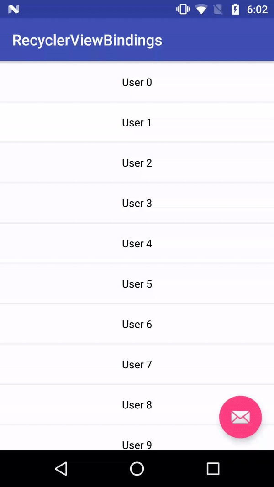

## RecyclerView Bindings

RecyclerViewBindings provides a wrapper class RecyclerViewScrollCallback which can be used to add Scroll to Bottom and Pull to Refresh capability to your RecyclerView. You can make use of DataBinding to bind it via XML.



## How to Use

```
    val callback = RecyclerViewScrollCallback
            .Builder(visibleThreshold, recyclerView.layoutManager)
            .resetLoadingState(resetLoadingState)
            .onScrolledToBottom(onScrolledToBottom)
            .build()

    recyclerView.addOnScrollListener(callback)
```

## How to Bind

In your `Gradle`

```
    dataBinding {
        enabled = true
    }
```

In your `BindingAdapter`

```
    /**
     * @param recyclerView  RecyclerView to bind to RecyclerViewScrollCallback
     * @param visibleThreshold  The minimum number of items to have below your current scroll position before loading more.
     * @param resetLoadingState  Reset endless scroll listener when performing a new search
     * @param onScrolledToBottom    OnScrolledListener for RecyclerView scrolled
     */
    @BindingAdapter(value = *arrayOf("visibleThreshold", "resetLoadingState", "onScrolledToBottom"), requireAll = false)
    fun setRecyclerViewScrollCallback(recyclerView: RecyclerView, visibleThreshold: Int, resetLoadingState: Boolean,
                                      onScrolledToBottom: RecyclerViewScrollCallback.OnScrolledListener) {

		... // add addOnScrollListener to RecyclerView using OnScrolledListener as above
    }

    /**
     * @param swipeRefreshLayout Bind swipeRefreshLayout with OnRefreshListener
     * @param onRefresh Listener for onRefresh when swiped
     */
    @BindingAdapter("onPulledToRefresh")
    fun setOnSwipeRefreshListener(swipeRefreshLayout: SwipeRefreshLayout, onPulledToRefresh: Runnable) {
        swipeRefreshLayout.setOnRefreshListener { onPulledToRefresh.run() }
    }
```

In your `XML` file

```
    <android.support.v4.widget.SwipeRefreshLayout
        android:id="@+id/srl"
        android:layout_width="match_parent"
        android:layout_height="match_parent"
        bind:onPulledToRefresh="@{() -> handler.onPulledToRefresh()}">

        <android.support.v7.widget.RecyclerView
            android:id="@+id/rv"
            android:layout_width="match_parent"
            android:layout_height="match_parent"
            android:background="@color/grey"
            app:layoutManager="android.support.v7.widget.LinearLayoutManager"
            bind:onScrolledToBottom="@{(page) -> handler.onScrolledToBottom(page)}"
            bind:resetLoadingState="@{model.resetLoadingState}"
            bind:visibleThreshold="@{model.visibleThreshold}" />

    </android.support.v4.widget.SwipeRefreshLayout>
```

## Library used

Add Android Support Design dependency to your gradle file.

```
    dependencies {
        compile 'com.android.support:design:{latest_version}'
    }
```

## Also try

- [Swipeable RecyclerView](https://github.com/chetdeva/swipeablerecyclerview)
- [Draggable RecyclerView](https://github.com/chetdeva/draggablerecyclerview)

## Reference

- [CodePath](https://github.com/codepath/android_guides/wiki/Endless-Scrolling-with-AdapterViews-and-RecyclerView)